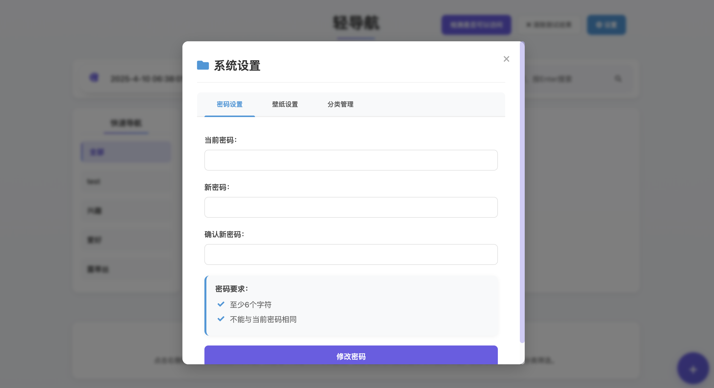

# 网址导航站

## 演示图片
首页


检测后展示


添加页面


编辑页面


安全验证页面


设置-密码设置


设置-壁纸设置


壁纸设置-上传本地图片


壁纸设置-url获取图片


设置-分类管理


## 项目简介

一个简洁、美观的网址导航站，可以添加、删除和管理常用网址链接，支持分类管理和搜索功能。

## 默认密码：admin123

## 功能特点

- 🌟 支持分类管理网址链接
  - 创建、编辑和删除分类
  - 将链接移动到不同分类
  - 分类排序和管理
- 🔍 站内搜索功能
- 🔄 集成百度、必应搜索引擎
- ✅ 网站可访问性检测
  - 一键检测所有链接是否可访问
  - 实时显示链接状态（可访问/不可访问）
- 📱 响应式设计，适配移动设备
- 💾 数据本地存储
- 🔐 设置密码保护
  - 更改密码功能
  - 验证密码访问管理功能
- 🖼️ 自定义壁纸设置
  - 上传本地图片作为壁纸
  - 通过URL添加壁纸
- 🎨 九宫格布局，美观易用
- 📋 链接管理功能
  - 添加新链接并选择分类
  - 编辑现有链接信息
  - 删除不需要的链接
  - 移动链接到其他分类

## 技术栈

- 前端：HTML5、CSS3、JavaScript（原生）
- 后端：Node.js、Express
- 数据存储：JSON文件

## 如何使用

### 方法一：使用启动脚本（推荐）

```bash
# 给脚本添加执行权限
chmod +x start.sh

# 运行脚本
./start.sh
```

### 方法二：手动安装并启动

```bash
# 安装依赖
npm install express body-parser

# 启动服务器
node server.js
```

服务器将在 http://localhost:3000 上运行。

## 使用说明

1. 点击右下角"+"按钮可以添加新网址
2. 添加网址时可以选择现有分类或直接创建新分类
3. 点击链接卡片上的"×"按钮可以删除网址
4. 点击"检测是否可以访问"按钮可以检测所有网址的可访问性
5. 使用搜索框可以快速查找已添加的网址
6. 切换顶部标签可以使用百度或必应搜索
7. 点击设置图标可以进行以下操作：
   - 管理分类（添加、编辑、删除）
   - 更改密码设置
   - 自定义壁纸（上传本地图片或使用URL）
8. 可以将链接从一个分类移动到另一个分类
9. 所有更改会自动保存到本地，下次打开时保持状态

## API 接口

项目提供以下主要API接口：

- `/api/check-links` - 检测链接可访问性
- `/api/links/move` - 移动链接到其他分类
- `/api/categories` - 管理分类（获取、添加、编辑、删除）
- `/api/links` - 管理链接（获取、添加、编辑、删除）

## 项目结构

整个项目采用模块化结构设计，具有清晰的前后端分离架构：

```
├── server.js                     # 后端服务器文件（Express应用入口）
├── start.sh                      # 启动脚本（自动安装依赖并启动服务器）
├── package.json                  # 项目配置和依赖管理
├── data/                         # 数据存储目录
│   ├── links.json                # 链接和分类数据（JSON格式）
│   └── auth.json                 # 认证和密码数据（包含哈希密码和盐值）
├── public/                       # 前端静态文件目录
│   ├── index.html                # 主页HTML结构（包含所有UI组件）
│   ├── css/                      # 样式文件目录
│   │   └── style.css             # 主样式表（响应式设计）
│   ├── js/                       # JavaScript文件目录
│   │   └── main.js               # 主脚本（包含所有前端功能实现）
│   ├── icons/                    # 图标文件目录
│   │   ├── favicon.ico           # 网站图标
│   │   └── favicon.svg           # SVG格式图标
│   └── images/                   # 图片资源目录
│       └── wallpapers/           # 壁纸存储目录（用户上传的壁纸）
```

### 主要文件说明

- **server.js**: 核心后端文件，包含API路由、数据处理逻辑和服务器配置
- **data/links.json**: 存储所有链接和分类信息的JSON文件，格式为分类数组，每个分类包含链接数组
- **data/auth.json**: 存储管理员密码的哈希值和随机盐值，用于安全验证
- **public/index.html**: 单页面应用的HTML结构，包含所有UI组件和模态窗口
- **public/css/style.css**: 包含所有样式定义，采用响应式设计适配不同设备
- **public/js/main.js**: 前端功能实现，包含数据获取、事件处理、UI渲染和用户交互逻辑

### 数据流向

1. 前端通过AJAX请求与后端API交互
2. 后端处理请求，读写JSON文件数据
3. 数据以JSON格式在前后端之间传输
4. 前端接收数据后进行处理和渲染

## 布局说明

项目布局设计精美，具有良好的用户体验：

### 整体结构
- 采用现代化九宫格布局设计
- 响应式设计，适配从手机到大屏显示器的各种设备
- 支持自定义壁纸，增强视觉体验
- 动画过渡效果流畅自然

### 主要组件
- **标题栏**：顶部包含网站标题、检测按钮和设置按钮
- **导航栏**：包含站内搜索、必应和百度三个选项卡，以及搜索框
- **链接区域**：主体部分采用网格布局，展示分类和链接卡片
- **链接卡片**：美观的卡片设计，悬停时显示编辑和删除按钮
- **浮动按钮**：右下角的"+"按钮，用于快速添加新链接
- **模态窗口**：多个功能模态窗口，包括:
  - 添加/编辑链接窗口
  - 分类管理窗口
  - 密码验证窗口
  - 设置窗口(密码设置、壁纸设置、分类管理)
  - 壁纸设置窗口

### 交互设计
- 卡片悬停效果：链接卡片悬停时显示编辑和删除按钮
- 检测结果直观显示：链接可访问性状态通过颜色和图标清晰表示
- 通知系统：操作结果通过弹出通知提示用户
- 模态窗口平滑过渡：打开和关闭时有动画效果
- 表单验证：输入验证确保数据正确性

### 主题和颜色
- 采用清新简约的配色方案
- 支持通过壁纸功能个性化界面
- 悬停和激活状态有明确的视觉反馈
- 功能图标简洁明了
